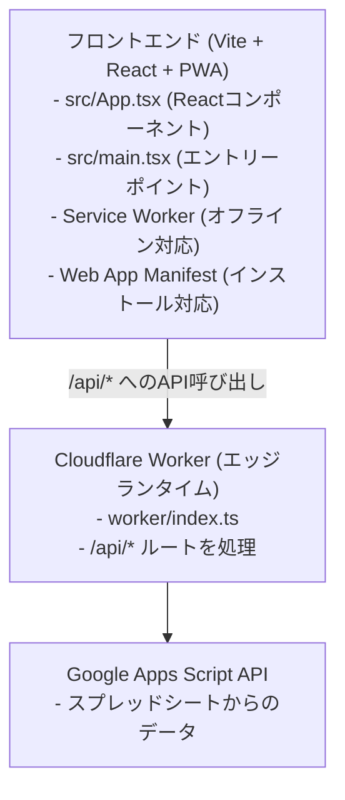

# CLAUDE.md

このファイルは、このリポジトリのコードを扱う際にClaude Code (claude.ai/code) に提供するガイダンスです。

## プロジェクト概要

家計簿ダッシュボード - Google Spreadsheetをデータベースとして活用し、家計の収支を可視化するWebアプリケーションです。

## アーキテクチャ概要

このプロジェクトは **Cloudflare Workers + Vite + React + PWA** のフルスタック構成です：



### 重要なポイント

- **単一デプロイユニット**: フロントエンドとWorkerは単一のCloudflare Workersプロジェクトとしてデプロイされます
- **開発環境**: `@cloudflare/vite-plugin` により、Vite開発サーバーがWorkerを統合して動作します
- **ルーティング**: Worker (`worker/index.ts`) が `/api/*` パスを処理し、それ以外は静的アセットとして配信されます
- **SPAモード**: `wrangler.jsonc` の `not_found_handling: "single-page-application"` により、クライアントサイドルーティングに対応しています
- **PWA対応**: `vite-plugin-pwa` により、Service WorkerとWeb App Manifestが自動生成され、オフライン対応とインストール機能を提供します

詳細なアーキテクチャは [docs/architecture.md](./docs/architecture.md) を参照してください。

## よく使うコマンド

```bash
# 開発サーバー（Vite + Worker統合）
pnpm dev

# ビルド（TypeScriptコンパイル + Viteビルド）
pnpm build

# ビルド済みアプリケーションをローカルでプレビュー
pnpm preview

# Cloudflare Workersにデプロイ
pnpm deploy

# コードのリント
pnpm lint

# テスト実行
pnpm test

# テスト（UIモード）
pnpm test:ui

# テスト（ウォッチモード）
pnpm test:watch

# テスト（カバレッジレポート）
pnpm test:coverage

# Cloudflare WorkerのTypeScript型を生成
pnpm cf-typegen
```

## 環境設定

1. `.dev.vars.example` を `.dev.vars` にコピー
2. 環境変数を設定:
   - `BASIC_AUTH_USERS`: Basic認証の認証情報（`user:pass` 形式、カンマ区切りで複数指定可）
   - `GAS_API_URL`: デプロイ済みGoogle Apps ScriptのURL

```bash
cp .dev.vars.example .dev.vars
# .dev.vars を編集して実際の値を設定
```

詳細なセットアップ手順は [docs/setup.md](./docs/setup.md) を参照してください。

## プロジェクト構造

```
src/
├── App.tsx              # メインアプリ（ダッシュボードUI）
├── index.css            # グローバルスタイル（Tailwind + グラスモーフィズム）
├── api/household.ts     # API呼び出し関数
├── hooks/useHouseholdData.ts  # データ取得フック
├── components/
│   ├── TotalAssetsChart.tsx    # 総資産推移グラフ
│   ├── IncomeExpenseChart.tsx  # 収入・支出比較グラフ
│   ├── CategoryExpenseChart.tsx # カテゴリ別支出グラフ
│   ├── BulkTransactionForm.tsx  # 一括取引入力フォーム（モーダル表示）
│   └── CategoryAmountInput.tsx # カテゴリ別金額入力コンポーネント
├── constants/
│   └── chartColors.ts   # チャートカラーパレット定義（Golden Sunlight Palette）
├── utils/
│   ├── format.ts        # フォーマット関数
│   ├── format.test.ts   # フォーマット関数のテスト
│   ├── month.ts         # 月関連のユーティリティ
│   ├── month.test.ts    # 月関連ユーティリティのテスト
│   ├── typeGuards.ts    # 型ガード
│   └── typeGuards.test.ts # 型ガードのテスト
└── types/index.ts       # 型定義

worker/
└── index.ts             # Cloudflare Worker（GAS APIプロキシ）

gas/
└── Code.gs              # Google Apps Script

public/
└── vite.svg             # PWAアイコン（デフォルト）

vite.config.ts           # Vite設定（VitePWAプラグイン含む）

# ビルド時に自動生成されるPWAファイル（dist/client/）
# - manifest.webmanifest  # Web App Manifest
# - sw.js                 # Service Worker
# - registerSW.js         # Service Worker登録スクリプト
```

## デプロイ

`pnpm deploy` により以下が実行されます：
1. TypeScript のビルド
2. Vite による静的アセットのバンドル
3. PWAファイルの生成（manifest.webmanifest、sw.js、registerSW.js）
4. Wrangler によるCloudflare Workersへのデプロイ

デプロイ先は `wrangler.jsonc` の `name: "expenses"` で指定されたWorker名になります。

PWAファイルも自動的にデプロイされ、Service WorkerとWeb App Manifestが有効になります。

## 参考ドキュメント

詳細な情報は以下のドキュメントを参照してください：

- [要件定義](./docs/requirements.md)
- [アーキテクチャ](./docs/architecture.md)
- [API仕様](./docs/api.md)
- [セットアップガイド](./docs/setup.md)
- [運用ガイド](./docs/usage.md)
- [開発ガイド](./docs/development.md)
