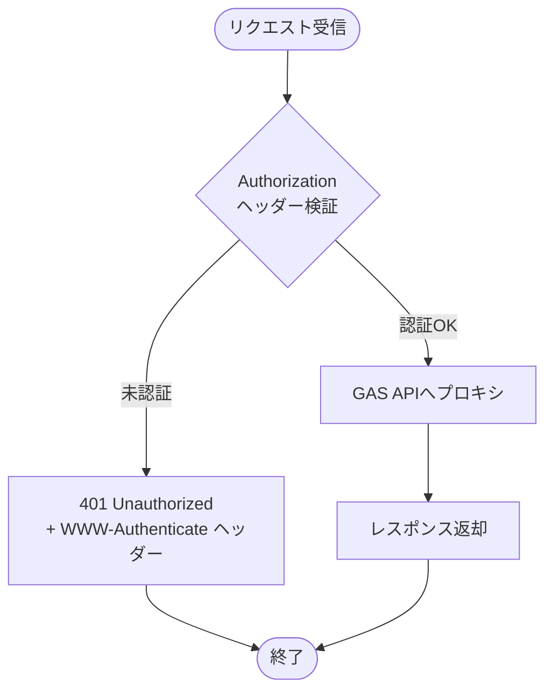

# API仕様

## Worker API（フロントエンドから呼び出し）

フロントエンドはCloudflare Worker経由でAPIにアクセスします。

| メソッド | パス | 説明 |
|---------|------|------|
| GET | `/api/` | GAS APIからデータ取得してプロキシ |
| POST | `/api/` | GAS APIへデータ追加をプロキシ |
| * | `/*` | 静的アセット配信（SPA対応） |

### 認証フロー



### エラーレスポンス形式

```json
{
  "success": false,
  "error": {
    "code": "UNAUTHORIZED",
    "message": "認証が必要です"
  }
}
```

## GAS API（Worker から呼び出し）

### GET - データ取得

```
GET https://script.google.com/macros/s/{DEPLOYMENT_ID}/exec
```

#### レスポンス

```json
{
  "success": true,
  "data": {
    "settings": {
      "initialBalance": 500000,
      "startMonth": "2025-01"
    },
    "monthlyData": [
      {
        "month": "2025-01",
        "income": 250000,
        "expense": 120000,
        "profit": 130000,
        "totalAssets": 630000,
        "categoryExpense": {
          "食費": 35000,
          "光熱費": 15000,
          "交通費": 10000
        }
      }
    ],
    "yearlyData": [
      {
        "year": "2025",
        "income": 3000000,
        "expense": 1800000,
        "profit": 1200000,
        "totalAssets": 1700000,
        "categoryExpense": {
          "食費": 420000,
          "光熱費": 180000,
          "交通費": 120000
        }
      }
    ],
    "categories": ["食費", "光熱費", "交通費", "娯楽"]
  }
}
```

### POST - レコード追加（バッチ対応）および残高更新

```
POST https://script.google.com/macros/s/{DEPLOYMENT_ID}/exec
```

#### リクエスト（トランザクション追加）

複数のトランザクションを一度に追加可能です。

```json
{
  "transactions": [
    {
      "month": "2025-01",
      "category": "食費",
      "type": "expense",
      "amount": 3500
    },
    {
      "month": "2025-01",
      "category": "交通費",
      "type": "expense",
      "amount": 5000
    }
  ]
}
```

**注意**: 単一トランザクションの形式（`transactions`配列なし）も後方互換性のためサポートされています。

```json
{
  "month": "2025-01",
  "category": "食費",
  "type": "expense",
  "amount": 3500
}
```

| フィールド | 型 | 説明 |
|-----------|-----|------|
| month | String | 対象月（YYYY-MM形式） |
| category | String | カテゴリ名（既存カテゴリから選択 または 新規入力） |
| type | String | `income`（収入）または `expense`（支出） |
| amount | Number | 金額（0以上の整数、typeに応じて符号が付与される） |

#### リクエスト（残高更新）

```json
{
  "balance": {
    "month": "2025-01",
    "balance": 630000
  }
}
```

| フィールド | 型 | 説明 |
|-----------|-----|------|
| month | String | 対象月（YYYY-MM形式） |
| balance | Number | 残高（0以上の整数） |

#### レスポンス

```json
{
  "success": true
}
```

## バリデーションルール

| フィールド | ルール |
|-----------|--------|
| month | 必須、YYYY-MM形式、開始月から先々月まで、既存データがない月のみ |
| category | 必須、既存カテゴリから選択 または 新規入力（1-50文字） |
| type | 必須、`income` または `expense` |
| amount | 必須、0以上の整数、上限10億 |
| balance | 必須、0以上の整数、上限10億 |

## TypeScript型定義

```typescript
// === API Types ===
interface Settings {
  initialBalance: number;
  startMonth: string; // YYYY-MM
}

interface MonthlyData {
  month: string; // YYYY-MM
  income: number;
  expense: number;
  profit: number;
  totalAssets: number;
  categoryExpense: Record<string, number>;
}

interface YearlyData {
  year: string; // YYYY
  income: number;
  expense: number;
  profit: number;
  totalAssets: number;
  categoryExpense: Record<string, number>;
}

interface HouseholdData {
  settings: Settings;
  monthlyData: MonthlyData[];
  yearlyData: YearlyData[];
  categories: string[];  // 選択肢として使用
}

interface ApiResponse<T> {
  success: boolean;
  data?: T;
  error?: { code: string; message: string };
}

// === Form Types ===
interface TransactionInput {
  month: string;      // YYYY-MM
  category: string;   // 既存カテゴリから選択
  type: 'income' | 'expense';
  amount: number;     // 0以上の数
}

interface BalanceInput {
  month: string;      // YYYY-MM
  balance: number;    // 0以上の数
}
```
