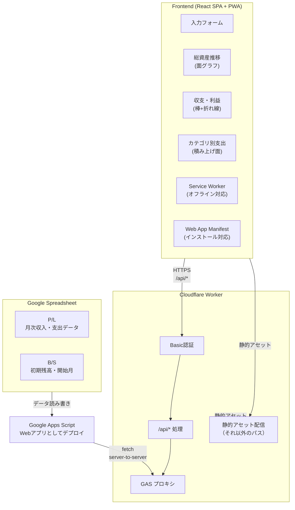

# アーキテクチャ

## システム構成

## データフロー

1. **P/L シート**: 月次の収入・支出を記録（手入力またはPOST API経由、0円も可）
2. **B/S シート**: 初期残高（手入力）、開始月（関数で自動取得）、月ごとの残高（手入力またはPOST API経由）を管理
3. **Google Apps Script**: スプレッドシートデータを集計してJSON APIとして公開
   - カテゴリは出現順を保持（アルファベット順ではない）
   - DateオブジェクトはYYYY-MM形式の文字列に変換
   - 総資産はB/Sシートの残高データを優先表示、未設定の月は初期残高と累積収支から算出
4. **Worker**: GAS APIへのプロキシ（Basic認証付き）、将来的にはキャッシュ層としても機能
5. **Frontend**: データを取得してグラフ表示、モーダルフォームから新規データ追加
   - 選択可能な月は開始月から先々月まで、既存データがない月のみ
   - Date文字列を正規化して処理（GASから返されるDate文字列に対応）
   - すべての入力フィールド（カテゴリ別金額、残高）は必須で初期値は0
6. **PWA**: Progressive Web Appとして動作
   - Service Workerによるオフライン対応とアセットキャッシュ
   - Web App Manifestによるインストール対応とスタンドアロンモード
   - 自動更新機能（新しいバージョンが自動で適用される）

## データ設計

### シート1: P/L（損益計算書 - 手入力 または API経由で追加）

月次の収入・支出を記録するシートです。

| カラム | 型 | 説明 |
|--------|-----|------|
| 月 | String | 対象月（YYYY-MM形式） |
| カテゴリ | String | 収支のカテゴリ（給与、食費など） |
| 金額 | Number | 正: 収入 / 負: 支出（0円も可） |

### シート2: B/S（貸借対照表 - 手入力 または API経由で追加）

初期残高、開始月、および月ごとの残高を管理するシートです。

| カラム | 型 | 説明 | 設定方法 |
|--------|-----|------|----------|
| 初期残高 | Number | 記録開始時点の総資産 | 手入力 |
| 開始月 | String | 記録開始月（YYYY-MM形式） | 関数で自動取得 |
| 月 | String | 対象月（YYYY-MM形式） | 手入力 または API経由 |
| 残高 | Number | その月の残高（円） | 手入力 または API経由 |

#### B/S シートの設定例

| A列 | B列 |
|-----|-----|
| 初期残高 | `500000`（手入力） |
| 開始月 | `=TEXT(MIN('P/L'!A:A),"YYYY-MM")` |
| 2025-01 | `630000`（手入力 または API経由） |
| 2025-02 | `750000`（手入力 または API経由） |

**注意:**
- 開始月は `P/L` シートの最小月を自動取得します
- 月ごとの残高は、フロントエンドの入力フォームからも追加・更新できます
- 残高が設定されている月は、総資産チャートでその残高が直接表示されます
- 残高が設定されていない月は、初期残高と累積収支から自動計算されます

## 残高管理と総資産計算

- **B/Sシートの構造**: B/Sシートには初期残高、開始月、および月ごとの残高が記録されます
- **残高の優先表示**: `aggregateMonthlyData`関数で、B/Sシートに残高が設定されている月はその残高を直接使用します
- **自動計算**: 残高が設定されていない月は、初期残高と累積収支から自動計算されます
- **残高の更新**: フロントエンドの入力フォームから残高を追加・更新できます

## PWA（Progressive Web App）機能

このアプリケーションはPWAとして実装されており、以下の機能を提供します。

### Service Worker

- **オフライン対応**: Service Workerがアセット（JS、CSS、HTML、画像など）をキャッシュし、オフライン時でもアプリケーションを利用可能にします
- **自動更新**: `registerType: 'autoUpdate'`により、新しいバージョンが自動で検出され、次回アクセス時に適用されます
- **キャッシュ戦略**: Workboxを使用して、静的アセットはプリキャッシュ、外部リソース（フォントなど）はCacheFirst戦略でキャッシュします

### Web App Manifest

- **インストール対応**: ブラウザのアドレスバーにインストールアイコンが表示され、ホーム画面に追加できます
- **スタンドアロンモード**: インストール後はブラウザUIなしでアプリケーションとして動作します
- **テーマカラー**: アプリのテーマカラーと背景色を設定し、OSのUIと統合されます

### 設定ファイル

PWAの設定は `vite.config.ts` の `VitePWA` プラグインで管理されています：

- **開発環境**: `devOptions.enabled: true`により、開発時でもPWA機能をテストできます
- **マニフェスト**: アプリ名、説明、アイコン、表示モードなどを定義
- **Workbox設定**: キャッシュパターン、ランタイムキャッシュ戦略を設定

### 生成されるファイル

ビルド時に以下のファイルが自動生成されます：

- `manifest.webmanifest`: Web App Manifest（アプリのメタデータ）
- `sw.js`: Service Worker（キャッシュ管理）
- `registerSW.js`: Service Worker登録スクリプト（エントリーポイントに自動注入）
