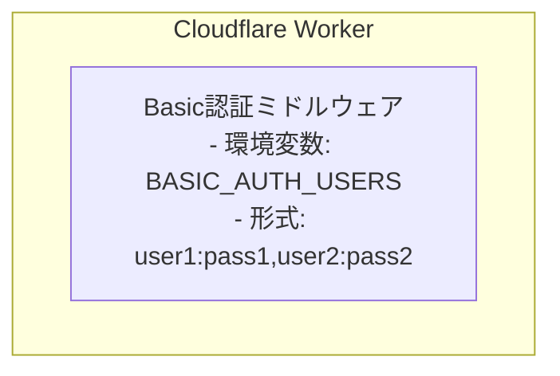

# 要件定義

## 機能要件

| ID | 要件 | 詳細 |
|----|------|------|
| F-01 | 総資産推移の表示 | B/Sシートの残高データを優先表示、未設定の月は初期残高と累積収支から算出（面グラフ） |
| F-02 | 収支・利益の表示 | 収入（正の棒）、支出（負の棒）、利益（折れ線）を同一グラフに表示 |
| F-03 | カテゴリ別支出の表示 | **支出のみ**をカテゴリごとに色分けした積み上げ面グラフで表示 |
| F-04 | 表示期間の切り替え | 月別表示と年別表示をボタンで切り替え可能 |
| F-05 | デフォルト表示期間 | **直近12ヶ月**（月別）/ **直近5年**（年別）をデフォルト表示 |
| F-06 | データ入力（スプレッドシート） | Google Spreadsheet に月・カテゴリ・金額、月ごとの残高を手入力 |
| F-07 | データ入力（フロントエンド） | 画面上のモーダルフォームから月・種別・カテゴリ・金額・残高を入力し**追加のみ**可能（編集・削除はスプシで直接行う）。選択可能な月は開始月から先々月までで、既にデータが存在する月は選択不可。すべての入力フィールドは必須で初期値は0 |
| F-08 | Basic認証 | URLへのアクセスにBasic認証を要求。家族等複数ユーザー対応 |

## 非機能要件

| ID | 要件 | 詳細 |
|-----|------|------|
| NF-01 | 可用性 | Google Spreadsheet / GAS の可用性に依存 |
| NF-02 | 保守性 | スプレッドシートのみでデータ管理可能、DB不要 |
| NF-03 | 拡張性 | カテゴリは選択式（既存カテゴリから選択 + 新規追加）、マスタ管理不要 |
| NF-04 | セキュリティ | Basic認証によるアクセス制限。認証情報はCloudflare環境変数で管理 |

## 認証設計

- 認証情報は `wrangler secret` で設定
- 未認証アクセスは 401 Unauthorized を返却
- 複数ユーザー（家族など）に対応可能

## エラーハンドリング

| 状況 | 挙動 |
|------|------|
| GAS API通信失敗 | エラーメッセージを表示し、リトライボタンを提供 |
| 認証失敗 | 401を返却、ブラウザの認証ダイアログを表示 |
| 無効なデータ入力 | フォームバリデーションでブロック、エラーメッセージ表示 |
